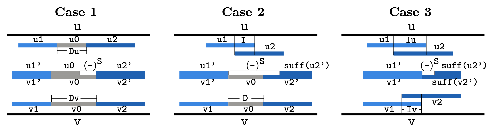

# PasteAlignments

A command-line tool to quickly combine ungapped DNA sequence alignments to form
gapped alignments.

* [Installation](#installation)
  + [Prerequisites](#prerequisites)
  + [Installation](#installation-1)
* [Usage](#usage)
  + [Input](#input)
  + [Basic](#basic)
  + [Pasting parameters](#pasting-parameters)
  + [Scoring parameters](#scoring-parameters)
  + [Input/output parameters](#input-output-parameters)
  + [Other parameters](#other-parameters)
  + [Configuration file](#configuration-file)
* [Algorithm](#algorithm)
  + [Legal configuration](#legal-configuration)
  + [Pastability](#pastability)
  + [Order of pasting](#order-of-pasting)
* [List of allowed scoring parameters](#list-of-allowed-scoring-parameters)

## Installation

### Prerequisites

* CMake 3.0 or higher
* C++17 compiler

The software was developed and tested on UNIX-like systems.

### Installation

1. clone or download and unpack repository
2.
```bash
cd PasteAlignments
mkdir build
cd build
cmake ..
make
```
3. Move binary `paste_alignments` from build directory to desired directory.

Comments:
* May require sudo privileges
* The binary `paste_alignments` may need to be modified to be executable
  (`[sudo] chmod +x paste_alignments`)
* To specify the C++ compiler to be used, add
  `-DCMAKE_CXX_COMPILER="/full/path/to/compiler/executable"` to the `cmake`
  command above
* To build and test unit tests, add `-DCMAKE_BUILD_TYPE="Debug"` to the `cmake`
  command above; tests can then be executed from the build directory using
  `ctest`

## Usage

### Basic

```bash
paste_alignments [options] --db_size INTEGER INPUT_FILE [OUTPUT_FILE]
```

* Use option `-h` or `--help` to print documentation
* `--db_size` referes to the size of the database query was BLASTed against to
  find input ungapped alignments (see [Input](#input-output-parameters))
* `INPUT_FILE` is the file of ungapped alignments obtained by BLAST (see
  [Input](#input-output-parameters))
* `OUTPUT_FILE` is optional and determines the file into which the gapped
  alignments are printed.

Basic example:
```bash
paste_alignments --db_size 1000000 ungapped_alignment_file pasted_output_file
```

### Input/output parameters

* INPUT_FILE
  Tab-delimited HSP table as returned by BLAST with option `-outfmt '6
  qseqid sseqid qstart qend sstart send nident mismatch gapopen gaps qlen
  slen length qseq sseq`. If executing in blind mode, the last two columns
  can be left out. Each alignment is considered to be on the minus strand
  if it's subject end coordinate precedes its subject start coordinate.
  Fields in excess of 13 (11 if in blind mode) are ignored.
* OUTPUT_FILE
  Tab-delimited HSP table with columns: qseqid sseqid qstart qend sstart
  send nident mismatch gapopen gaps qlen slen length qseq sseq pident
  score bitscore evalue nmatches rows, where nmatches is the number of N-N
  matches and 'rows' is a comma-separated list of row numbers for the
  alignments from the input file that, when pasted together, constitute
  the output alignments. If executing in blind mode, the qseq and sseq
  columns are omitted. For alignments on the minus strand, the subject end
  coordinate precedes its subject start coordinate.
* -y, --summary, --summary_file SUMMARY_FILE
  Print overall statistics in JSON format with 1: number of alignments, 2:
  number of pastings performed, 3: average alignment length, 4: average
  percent identity, 5: average raw alignment score, 6: average bitscore,
  7: average evalue, 8: average number of unknown N-N matches (which are
  treated as mismatches.
* -s, --stats, --stats_file STATS_FILE
  Print tab-separated data with columns: 1: query sequence identifier, 2:
  subject sequence identifier, 3: number of alignments, 4: number of
  pastings performed, 5: average alignment length, 6: average percent
  identity, 7: average raw alignment score, 8: average bitscore, 9:
  average evalue, 10: average number of unknown N-N matches (which are
  treated as mismatches.
* -c, --config, --configuration_file CONFIGURATION_FILE
  Read parameters from configuration file (see
  [Configuration file](#configuration-file)).

Input/output example:
```bash
paste_alignments -d 1000000 -c configuration.config ungapped_alignment_file pasted_output_file -y pasted_summary_file -s pasted_stats_file
```

### Pasting parameters

* -g, --gap, --gap_tolerance INTEGER ( = 4)
  Maximum gap length allowed to be introduced through pasting.
* --final_pident, --final_pident_threshold FLOAT ( = 0.0)
  Percent identity threshold alignments must satisfy to be included in the
  output.
* --final_score, --final_score_threshold FLOAT ( = 0.0)
  Raw score threshold alignments must satisfy to be included in the
  output.
* --intermediate_pident, --intermediate_pident_threshold FLOAT ( = 0.0)
  Percent identity threshold that must be satisfied during pasting.
* --intermediate_score, --intermediate_score_threshold FLOAT ( = 0.0)
  Raw score threshold that must be satisfied during pasting.
* --blind, --blind_mode
  Disregard actual sequences during pasting. No alignment sequences are
  read or constructed during pasting in this mode. However query and
  subject coordinates, number of identities, mismatches, gap openings, and
  gap extensions (and thus percent identity, score, bitscore, and evalue)
  are still computed.
* --enforce_avg_score, --enforce_average_score
  Paste alignments only when the pasted score is at least as large as the
  average score of the two alignments.

Pasting parameters example:
```bash
paste_alignments --blind --enforce_avg_score -d 1000000 -g 10 --intermediate_pident 50.0 --final_pident 90.0 --intermediate_score 0.0 --final_score 250.0 ungapped_alignment_file pasted_output_file
```

### Scoring parameters

Only a specific set of match reward, mismatch penalty, gap open cost and gap
extension cost is allowed. See [List of allowed scoring
parameters](#list-of-allowed-scoring-parameters).

* -d, --db, --db_size INTEGER
  Size of the database used for the BLAST search. Required for the
  computation of evalues. (This value can be obtained using the command
  `blastdbcmd -info -db BLAST_DATABASE_NAME` in the database's directory,
  which lists the value as the total number of residues)
* -r, --reward, --match_reward INTEGER ( = 1)
  Match reward used to compute score, bitscore, and evalue. Only a fixed
  set of values is supported.
* -p, --penalty, --mismatch_penalty INTEGER ( = 2)
  Mismatch penalty used to compute score, bitscore, and evalue. Only a
  fixed set of values is supported.
* -o, --gapopen, --gapopen_cost INTEGER ( = 0)
  Gap opening cost used to compute score, bitscore, and evalue. Only a
  fixed set of values is supported. For megablast scoring parameters set
  this value to 0.
* -e, --gapextend, --gapextend_cost INTEGER ( = 0)
  Gap extension cost used to compute score, bitscore, and evalue. Only a
  fixed set of values is supported. For megablast scoring parameters set
  this value to 0.

Scoring parameters example:
```bash
paste_alignments -d 1000000 -r 2 -p 3 -o 5 -e 2 ungapped_alignment_file pasted_output_file
```

### Other parameters

* -h, --help
  Print help message and exit.
* --version
  Print the software's version and exit.
* --float_epsilon FLOAT ( = 0.01)
  Used for floating point comparison of the C++ `float` data type.
* --double_epsilon FLOAT ( = 0.01)
  Used for floating point comparison of the C++ `double` data type.

Two floating points `x` and `y` are considered equal by the software if both are
0.0, or:
```Python
|x - y| <= min(epsilon * |x|, epsilon * |y|)
```
where `epsilon` is the respective data type's `epsilon` value as specified by
the parameters `--float_epsilon` and `--double_epsilon`.

### Configuration file

A configuration file storing a desired set of parameter values can be specified
using the `--configuration_file` keyword parameters ([see Input/output
parameters](#input-output-parameters)). When a parameter values is specified
both on the command line and in the configuration file, the command line value
overrules the configuration file value. The software comes with a default
configuration file named [`default.config`](default.config), which specifies how
to format configurations at the top. It is recommended to copy the file instead
of modifying it directly.

## Algorithm

The software takes a set of ungapped alignments and returns a set of gapped
alignments obtained by combining (*pasting*) ungapped alignments in a specific
way. The section [Legal configuration](#legal-configuration) describes the
configuration two alignments must be in to be considered for pasting, the
section [Pastability](#pastability) specifies exactly when two legally
configured alignments are pasted and the section [Order of
pasting](#order-of-pasting) explains how this pasting technique is applied to
the input set of alignments.

### Legal configuration

Given two *positively* oriented alignemnts `A1` with query (start, end)
coordinates `(a1, b1)` and subject (start, end) coordinates `(c1, d1)` and `A2`
with query (start, end) coordinates `(a2, b2)` and subject (start, end)
coordinates `(c2, d2)`, the pair of alignments (`A1`, `A2`) are in ***legal
configuration*** if:
1. `a1 < a2` and `b1 < b2`, and
2. `c1 < c2` and `d1 < d2`.

When both alignments are *negatively oriented*, then the requirements stay the
same, but viewing the subject segment of the alignments on the reverse
complementary strand. For example subject (start, end) coordinates `(a,b)` for
a subject sequence of length `N` can be viewed as (start, end) coordinates
`(N - b + 1, N - a + 1)` on the reverse complement of the subject sequence. Note
that here we assume `a < b` even though the alignment is negatively oriented,
whereas BLAST returns the larger coordinate of the two as the `sstart`
coordinate, and the other as the `send` coordinate for negatively oriented
alignments.

Two alignments of opposite orientations are never in legal configuration.

### Pastability

Given two alignments in legal configuration, the software computes (lower bounds
of the score and percent identity that the pasted alignment would have. These
score and percent identity values are compared against respective thresholds,
and if those thresholds are met or exceeded, the algorithm pastes the alignments
together.

To describe how percent identity and score of a pasted alignment are calculated,
we break down legal configurations of a pair of alignments (`A1`, `A2`) into
three cases.



The images show how the pasted alignments are constructed. In all three cases,
two local alignments of sequences `u` and `v` are shown. One of the alignments
aligns regions `u1` in `u` with region `v1` in `v` and the other aligns regions
`u2` in `u` with `v2` in `v`. The respective pars of the sequence alignments
(regions of `u` and `v` possibly with gaps inserted) are `u1'`, `v1'`, `u2'`,
and `v2'`. In all cases, `u1` and `v1` appear before `u2` and `v2` (legal
configuration). The constructed pasted alignment is an alignment of the regions
in `u` starting at the start coordinate of `u1` and ending at the end coordinate
of `u2` and the region in `v` starting at the start coordinate of `v1` and
ending at the end coordinate of `v2`.

*Case 1:*
`u1` and `u2` are a non-negative distance `Du` apart and `v1` and `v2` are a
non-negative distance `Dv` apart. Assume `Du <= Dv`; the opposite case works
analogously.

1. Set `S = |Du - Dv|`.
2. Construct the `u`-portion of the pasted alignment by placing the sequence
   `u0` in `u` appearing between `u1` and `u2` followed by a gap of length `S`
   between `u1'` and `u2'`.
3. Construct the `v`-portion of the pasted alignment by placeing the sequence
   `v0` in `v` appearing between `v1` and `v2` between `v1'` and `v2'`.

Then the score is at least:
```
score(u1', v1') + score(u2', v2') - mismatch_penalty * |u_0| - gap_penalty(S)
```
And the percent identity is at least:
```
(nident(u1', v1') + nident(u2', v2')) / (|u1'| + |u2'| + Dv)
```
Note that the grey regions here are all assumed to be mismatches and returned as
`N-N` matches by the software.

*Case 2:*
`u1` and `u2` intersect in `I` basepairs and `v1` and `v2` are a non-negative
distance `D` apart. The case where `v1` and `v2` intersect and `u1` and `u2` do
not, works analogously.

1. Set `S = I + D`.
2. Construct the `u`-portion of the pasted alignment by placing a gap of length
   `S` between `u1'` and the suffix of `u2'` of length `|u2'| - I`.
3. Construct the `v`-portion of the pasted alignment by placing the sequence
   `v0` in `v` appearing between `v1` and `v2` between `v1'` and `v2'`.

Then the score is at least:
```
score(u1', v1') + score(u2', v2') - match_reward(I) - gap_penalty(S)
```
And the percent identity is at least:
```
(nident(u1', v1') + nident(u2', v2') - I) / (|u1'| + |u2'| + D)
```
Note that the chopped-off portion of the alignment (`u2'`, `v2'`) was assumed to
consist entirely of identical matches.

*Case 3:*
`u1` and `u2` intersect in `Iu` basepairs and `v1` and `v2` intersect in `Iv`
basepairs. Assume `Iu >= Iv`; the opposite case works analogously.

1. Set `S = |Iu - Iv|`.
2. Construct the `u`-portion of the pasted alignment by placing a gap of length
   `S` between `u1'` and the suffixe of `u2'` of length `|u2'| - Iu`.
3. Construct the `v`-portion of the pasted alignment by placing the suffix of
   `v2'` of length `|v2'| - Iv` right after `v1'`.

Then the score is at least:
```
score(u1', v1') + score(u2', v2') - match_reward(Iu) - gap_penalty(S)
```
And the percent identity is at least:
```
(nident(u1', v1') + nident(u2', v2') - Iu) / (|u1'| + |u2'| - Iv)
```
Note that the chopped-off portion of the alignment (`u2'`, `v2'`) was assumed to
consist entirely of identical matches.

These calculations are only guaranteed to be valid as long as the maximal
ungapped prefix of `u2'` is longer than the intersection of `u1` and `u2` and the maxmal ungapped prefix of `v2'` is longer than the intersection of `v1` and
`v2`.

Note that the gap introduced in case 1 could have been introduced adjacent to
`u1'` as opposed to `u2'` and that in cases 2 and 3 we could have truncated the
alignment (`u1'`, `v1'`) as opposed to (`u2'`, `v2'`). The scores and percent
identity calculations would be the same but the resulting maximal ungapped
prefix and suffix lengths could vary. The method depicted in the picture will be
referred to here as ***right-pasting*** and the other option (introducing gaps
further left and keeping (`u2'`, `v2'`) intact) is referred to as
***left-pasting***.

### Order of pasting

The order of pasting is best described by this pseudocode:

```
INPUT: Set A of ungapped alignments.
L_pasted <- []
L_score <- A, sort by decreasing score
L_start <- A, sort by increasing subject start coordinate
L_end <- A, sort by decreasing subject end coordinate
for a in L_score do:
  Mark(a)
  l,r <- position of a in L_end, L_start, respectively
  L_unmark <- []
  l <- NextLeftPastable(L_end, l, a)
  r <- NextRightPastable(L_start, r, a)
  a' <- a
  a_stable <- None
  while l <= |L_end| or r <= |L_start| do:
    if r > |L_start| or score(L_end[l]) > score(L_start[r]) then:
      a' <- left-paste(L_end[l], a')
      Mark(L_end[l])
      Append L_end[l] to L_unmark
    else:
      a' <- right-paste(a', L_start[r])
      Mark(L_start[r])
      Append L_start[r] to L_unmark
    end if
    if score(a') >= final_score and pident(a') >= final_pident then:
      a_stable <- a'
      Empty L_unmark
    end if
    l <- NextLeftPastable(L_end, l, a')
    r <- NextRightPastable(L_start, r, a')
  done
  Unmark each member of L_unmark
  if a_stable not None then:
    append a_stable to L_pasted
  end if
done
```

* `NextLeftPastable(L, i, a)` repeatedly tests `(L[i], a)` for left-pastability
  by testing for legal configuration and then comparing pasted score and pident
  to intermediate score and pident thresholds until end of list is reached or a
  candidate for left-pasting was found.
* `NextRightPastable(L, j, a)` repeatedly tests `(a, L[j])` for
  right-pastability by testing for legal configuration and then comparing pasted
  score and pident to intermediate score and pident thresholds until end of list
  is reached or a candidate for right-pasting was found.
* `Mark(a)` marks an alignment so that `NextLeftPastable` and
  `NextRightPastable` skip the alignment while searching for pasting candidates.


## List of allowed scoring parameters

reward | penalty | gap open cost | gap extension cost | lambda | K
--- | --- | --- | --- | --- | ---
1 | 5 | 0 | 0 | 1.39 | 0.747
1 | 5 | 3 | 3 | 1.39 | 0.747
1 | 4 | 0 | 0 | 1.383 | 0.738
1 | 4 | 1 | 2 | 1.36 | 0.67
1 | 4 | 0 | 2 | 1.26 | 0.43
1 | 4 | 2 | 1 | 1.35 | 0.61
1 | 4 | 1 | 1 | 1.22 | 0.35
2 | 7 | 0 | 0 | 0.69 | 0.73
2 | 7 | 2 | 4 | 0.68 | 0.67
2 | 7 | 0 | 4 | 0.63 | 0.43
2 | 7 | 4 | 2 | 0.675 | 0.62
2 | 7 | 2 | 2 | 0.61 | 0.35
1 | 3 | 0 | 0 | 1.374 | 0.711
1 | 3 | 2 | 2 | 1.37 | 0.70
1 | 3 | 1 | 2 | 1.35 | 0.64
1 | 3 | 0 | 2 | 1.25 | 0.42
1 | 3 | 2 | 1 | 1.34 | 0.60
1 | 3 | 1 | 1 | 1.21 | 0.34
2 | 5 | 0 | 0 | 0.675 | 0.65
2 | 5 | 2 | 4 | 0.67 | 0.59
2 | 5 | 0 | 4 | 0.62 | 0.39
2 | 5 | 4 | 2 | 0.67 | 0.61
2 | 5 | 2 | 2 | 0.56 | 0.32
1 | 2 | 0 | 0 | 1.28 | 0.46
1 | 2 | 2 | 2 | 1.33 | 0.62
1 | 2 | 1 | 2 | 1.30 | 0.52
1 | 2 | 0 | 2 | 1.19 | 0.34
1 | 2 | 3 | 1 | 1.32 | 0.57
1 | 2 | 2 | 1 | 1.29 | 0.49
1 | 2 | 1 | 1 | 1.14 | 0.26
2 | 3 | 0 | 0 | 0.55 | 0.21
2 | 3 | 4 | 4 | 0.63 | 0.42
2 | 3 | 2 | 4 | 0.615 | 0.37
2 | 3 | 0 | 4 | 0.55 | 0.21
2 | 3 | 3 | 3 | 0.615 | 0.37
2 | 3 | 6 | 2 | 0.63 | 0.42
2 | 3 | 5 | 2 | 0.625 | 0.41
2 | 3 | 4 | 2 | 0.61 | 0.35
2 | 3 | 2 | 2 | 0.515 | 0.14
3 | 4 | 6 | 3 | 0.389 | 0.25
3 | 4 | 5 | 3 | 0.375 | 0.21
3 | 4 | 4 | 3 | 0.351 | 0.14
3 | 4 | 6 | 2 | 0.362 | 0.16
3 | 4 | 5 | 2 | 0.330 | 0.092
3 | 4 | 4 | 2 | 0.281 | 0.046
4 | 5 | 0 | 0 | 0.22 | 0.061
4 | 5 | 6 | 5 | 0.28 | 0.21
4 | 5 | 5 | 5 | 0.27 | 0.17
4 | 5 | 4 | 5 | 0.25 | 0.10
4 | 5 | 3 | 5 | 0.23 | 0.065
1 | 1 | 3 | 2 | 1.09 | 0.31
1 | 1 | 2 | 2 | 1.07 | 0.27
1 | 1 | 1 | 2 | 1.02 | 0.21
1 | 1 | 0 | 2 | 0.80 | 0.064
1 | 1 | 4 | 1 | 1.08 | 0.28
1 | 1 | 3 | 1 | 1.06 | 0.25
1 | 1 | 2 | 1 | 0.99 | 0.17
3 | 2 | 5 | 5 | 0.208 | 0.030
5 | 4 | 10 | 6 | 0.163 | 0.068
5 | 4 | 8 | 6 | 0.146 | 0.039
